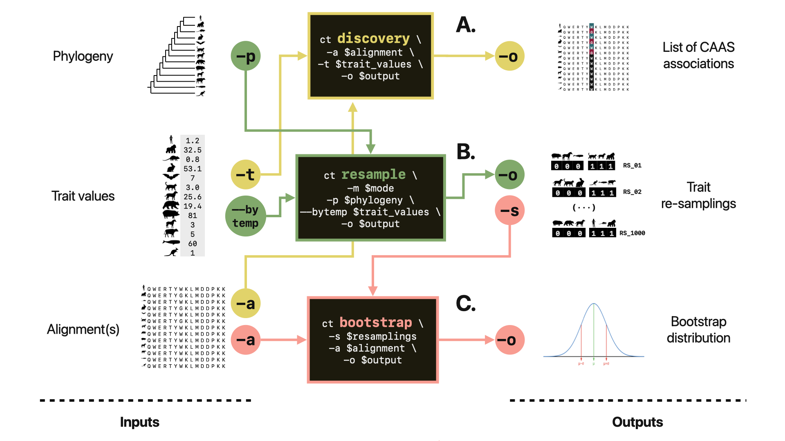

*Last site update **May 2023***. My name is Fabio Barteri and I am a Computational Biologist at the [Barcelona Beta Brain Research Centre](https://www.barcelonabeta.org/en) and [Universitat Pompeu Fabra](https://www.ibe.upf-csic.es/). I work as a Bioinformatics Lab Manager in the group led by Prof. [Arcadi Navarro](https://twitter.com/ArcadiNavarro).

# Research interests
My scientific activity revolves aroud the implementation of computational approaches to infer genome-phenome maps from evolutionary data. 

## Convergent Amino Acid Substitutions
Amino Acid substitutions that are consistent with phenotype convergence can indicate that the protein is linked to that phenotype. We call these mutations Convergent Amino Acid Substitutions (CAAS). CAAS can represent an important starting point to reconstruct the genetic background of complex traits. At the moment, we are striving to improve our CAAS detection and validation strategy.

### CAAStools, a toolbox to identify and test Convergent Amino Acid Substitutions



In the last years, the our lab @ UPF-Barcelona has developed a strategy to identiy, test and validate CAAS in orthologous protein alignments from different mammalian species. In 2023 we released CAAStools, a toolbox written in Python that allows the user to detect and test CAAS. 

CAAStools source code is [available in GitHub](https://github.com/linudz/caastools). Introductory pre-print is [on BioRXiv](https://www.biorxiv.org/content/10.1101/2022.12.14.520422v2).

**INSTALLATION**
```
git clone https://github.com/linudz/caastools
export PATH=$PATH:caastools_folder_path
```

## Simulation of trait evolution.
Quantitative traits can variate considerably within and between species. Sometimes this variation comes from neutral evolution, sometimes is the consequence of selective pressure.

# Lab Management
As a Bioinformatics lab manager in the Navarro's group, I take care of several aspects of the bioinformatics routine in the lab.

# Selected Publications
A full list of my publications is available in my [Google Scholar](https://scholar.google.com/citations?user=Na2xNecAAAAJ&hl=it). Here I report just a few references that better explain what I am doing at the moment.

**CAAStools, a toolbox to identify and test Convergent Amino Acid Substitutions.** ***Barteri et al.,*** **[BiorXIV, 2023](https://www.biorxiv.org/content/10.1101/2022.12.14.520422v2.abstract)**

**Comparative analysis of mammal genomes unveils key genomic variability for human life span.** ***Farré et al.,*** **[Molecular Biology and Evolution, 2021](https://academic.oup.com/mbe/article/38/11/4948/6326808)**

**The Role of Transposable Elements in Congenital Malformations with Notes on Their Potential Implications for Morphological Evolution in Mammals.** ***Barteri and Esteve-Altava,*** **[ Current Molecular Biology Reports, 2023](https://link.springer.com/article/10.1007/s40610-020-00134-z)**

# A few more facts about me

**I come from Rome** where I was born (1985) and raised. I moved to Barcelona in 2015 for my PhD, and I have been living there ever since.

The nickname **linudz** comes from "Linus" and it is a reference to [Linus Van Pelt](https://it.wikipedia.org/wiki/Linus_van_Pelt). It has always been my nickname on the internet (even though there are few other "linudz" out there).

I have graduated in **Cell Biology** with a computational thesis on Gut Microbiota. Then I did my PhD in [Evolutionary Plant Genomics](https://www.educacion.gob.es/teseo/imprimirFicheroTesis.do?idFichero=BXYF28m1rvo%3D) to later move to animal evolution.

I was on **Mastodon** before it became ***muskstream***. I have my (scientific account)[https://genomic.social/@linus] and a (personal account)[https://mastodon.uno/@linudz] on an Italian instance. You'll find me there.

I have always been an antifascist activist. I participated in several grassroot organizations (mostly libertarian), both in **Rome** and in **Barcelona**. 

I support **AS Roma**, but I use to go to Barcelona's local team [CE Europa](https://en.wikipedia.org/wiki/CE_Europa) games on Sunday. This latter is probably the third most hipster thing I do (after being on Mastodon and having this website).